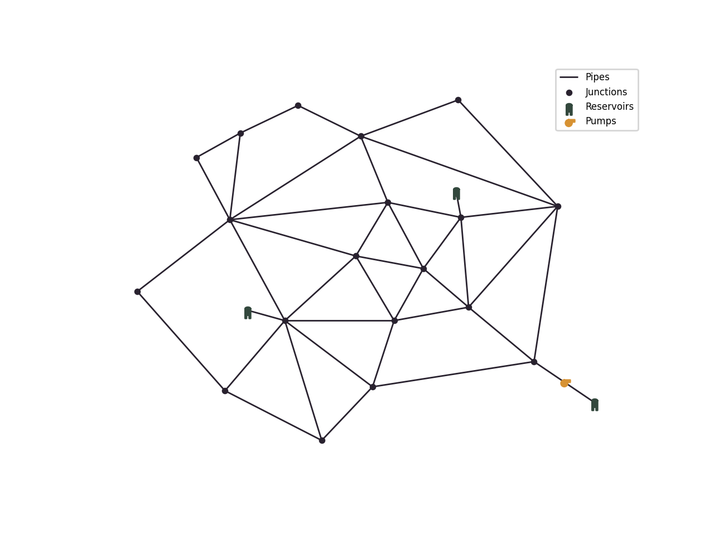
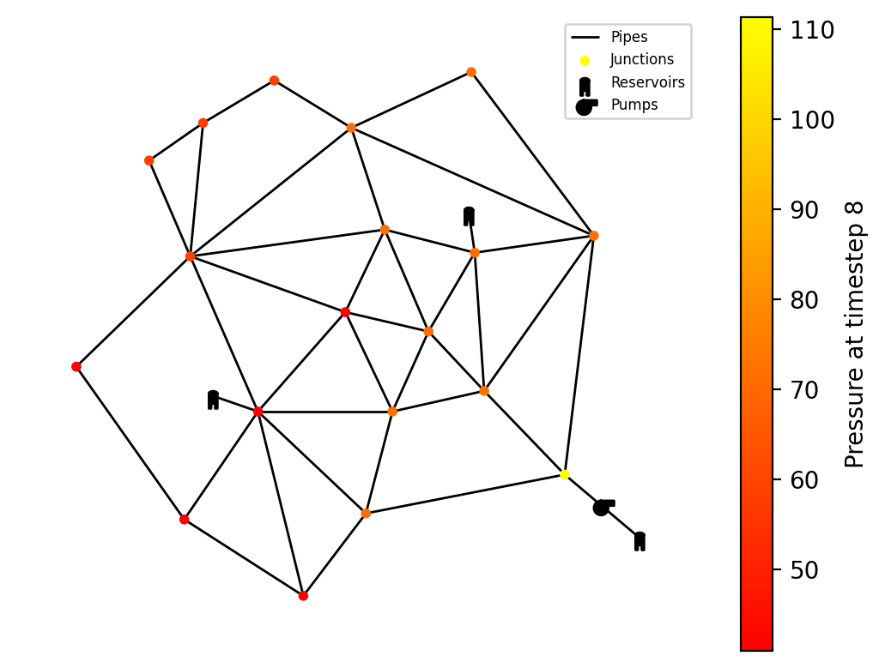
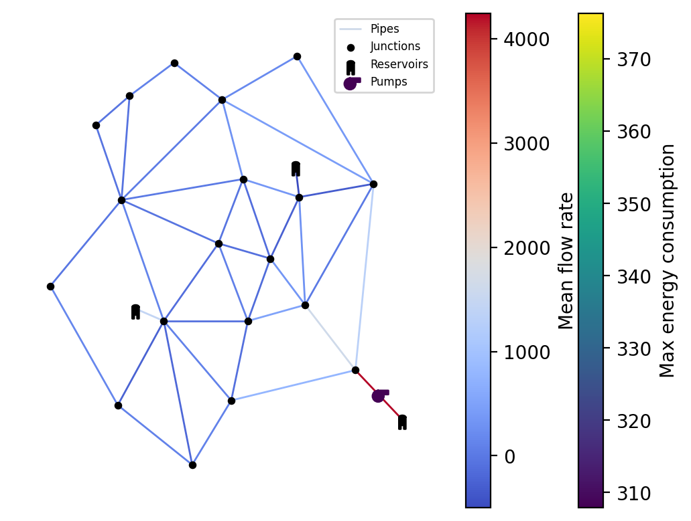

.. _tut.visualization:

*************
Visualization
*************

This guide explains how to visualize water distribution networks using the
:class:`~epyt_flow.visualization.scenario_visualizer.ScenarioVisualizer` class.

The :class:`~epyt_flow.visualization.scenario_visualizer.ScenarioVisualizer` class allows for
generating plots, animations and customizations, according to the
:class:`~epyt_flow.simulation.scada_data.ScadaData` generated by the
:class:`~epyt_flow.simulation.scenario_simulator.ScenarioSimulator`.

Setup and basic visualization
-----------------------------

In order to setup a new :class:`~epyt_flow.visualization.scenario_visualizer.ScenarioVisualizer`
instance, we first have to create a new
:class:`~epyt_flow.simulation.scenario_simulator.ScenarioSimulator` instance.

The :class:`~epyt_flow.simulation.scenario_simulator.ScenarioSimulator` instance is then provided
to the :class:`~epyt_flow.visualization.scenario_visualizer.ScenarioVisualizer`.

.. code-block:: python

    # Load a network configuration and create a ScenarioSimulator with it
    network_config = load_anytown(verbose=False)
    with ScenarioSimulator(scenario_config=network_config) as wdn:
        # Create a ScenarioVisualizer object and show the network topology plot
        vis = ScenarioVisualizer(wdn)
        vis.show_plot()

The :meth:`~epyt_flow.visualization.scenario_visualizer.ScenarioVisualizer.show_plot` method
visualizes the network:

.. note::

    Alternatively, you can use the
    :meth:`~epyt_flow.simulation.scenario_simulator.ScenarioSimulator.plot_topology` function of
    a :class:`~epyt_flow.simulation.scenario_simulator.ScenarioSimulator` instance.

Customization
-------------

The hydraulic components can be colored according to the simulation results by calling the
corresponding methods:

- :meth:`~epyt_flow.visualization.scenario_visualizer.ScenarioVisualizer.color_nodes`
- :meth:`~epyt_flow.visualization.scenario_visualizer.ScenarioVisualizer.color_links`
- :meth:`~epyt_flow.visualization.scenario_visualizer.ScenarioVisualizer.color_pumps`
- :meth:`~epyt_flow.visualization.scenario_visualizer.ScenarioVisualizer.color_tanks`
- :meth:`~epyt_flow.visualization.scenario_visualizer.ScenarioVisualizer.color_valves`

The :class:`~epyt_flow.simulation.scada.scada_data.ScadaData` is generated inside the methods
using the provided :class:`~epyt_flow.simulation.scenario_simulator.ScenarioSimulator` instance 
from initialization, but it can also be set explicitly by setting the `scada_data` attribute.

The two main arguments for customization are called `parameter` and `statistic`. `Parameter` refers
to which data to use for coloring and the `statistic` refers to the processing of that data.
Both are supplied as string.

The `parameter` options depend on the hydraulic component and are listed with their data source
in the following table:

+------------------------------------+--------------------------------------------------------------------------------+
| Node parameter                     | Corresponding data source                                                      |
+====================================+================================================================================+
| pressure                           | :attr:`~epyt_flow.simulation.scada.scada_data.ScadaData.pressure_data_raw`     |
+------------------------------------+--------------------------------------------------------------------------------+
| demand                             | :attr:`~epyt_flow.simulation.scada.scada_data.ScadaData.demand_data_raw`       |
+------------------------------------+--------------------------------------------------------------------------------+
| node_quality                       | :attr:`~epyt_flow.simulation.scada.scada_data.ScadaData.node_quality_data_raw` |
+------------------------------------+--------------------------------------------------------------------------------+

+------------------------------------+--------------------------------------------------------------------------------+
| Link parameter                     | Corresponding data source                                                      |
+====================================+================================================================================+
| flow_rate                          | :attr:`~epyt_flow.simulation.scada.scada_data.ScadaData.flow_data_raw`         |
+------------------------------------+--------------------------------------------------------------------------------+
| link_quality                       | :attr:`~epyt_flow.simulation.scada.scada_data.ScadaData.link_quality_data_raw` |
+------------------------------------+--------------------------------------------------------------------------------+
| diameter                           | :meth:`~epyt_flow.topology.NetworkTopology.get_link_info`                      |
+------------------------------------+--------------------------------------------------------------------------------+

+------------------------------------+------------------------------------------------------------------------------------------+
| Pump parameter                     | Corresponding data source                                                                |
+====================================+==========================================================================================+
| efficiency                         | :attr:`~epyt_flow.simulation.scada.scada_data.ScadaData.pumps_efficiency_data_raw`       |
+------------------------------------+------------------------------------------------------------------------------------------+
| energy_consumption                 | :attr:`~epyt_flow.simulation.scada.scada_data.ScadaData.pumps_energyconsumption_data_raw`|
+------------------------------------+------------------------------------------------------------------------------------------+
| state                              | :attr:`~epyt_flow.simulation.scada.scada_data.ScadaData.pumps_state_data_raw`            |
+------------------------------------+------------------------------------------------------------------------------------------+

+------------------------------------+--------------------------------------------------------------------------------+
| Tank parameter                     | Corresponding data source                                                      |
+====================================+================================================================================+
| default                            | :attr:`~epyt_flow.simulation.scada.scada_data.ScadaData.tanks_volume_data_raw` |
+------------------------------------+--------------------------------------------------------------------------------+

+------------------------------------+--------------------------------------------------------------------------------+
| Valve parameter                    | Corresponding data source                                                      |
+====================================+================================================================================+
| default                            | :attr:`~epyt_flow.simulation.scada.scada_data.ScadaData.valves_state_data_raw` |
+------------------------------------+--------------------------------------------------------------------------------+

The `statistic` decides how the simulation data over time is processed to one value which
can be displayed. It has the following options:

- mean
- min
- max
- time_step

If time_step is selected, the point in time must be provided via the `pit` parameter.

.. note::

    Example: When calling
    :meth:`~epyt_flow.visualization.scenario_visualizer.ScenarioVisualizer.color_nodes` with the
    `parameter` pressure and the `statistic` max, each node in the network is colored according
    to its maximum pressure value during the simulation time.

Here are two examples:

.. code-block:: python

    # Load a network configuration and create a ScenarioSimulator with it
    network_config = load_anytown(verbose=False)
    with ScenarioSimulator(scenario_config=network_config) as wdn:
        vis = ScenarioVisualizer(wdn, color_scheme=black_colors)

        # Color nodes according to the pressure at time step 8
        vis.color_nodes(parameter='pressure', statistic='time_step', pit=8,
                        colormap='autumn', show_colorbar=True)
        vis.show_plot()

.. code-block:: python

    # Load a network configuration and create a ScenarioSimulator with it
    network_config = load_anytown(verbose=False)
    with ScenarioSimulator(scenario_config=network_config) as wdn:
        vis = ScenarioVisualizer(wdn, color_scheme=black_colors)

        # Color the pumps according to the maximum energy consumption during the simulation time
        vis.color_pumps(parameter='energy_consumption', statistic='max',
                        show_colorbar=True)

        # Color the links according to the mean flow rate
        vis.color_links(parameter='flow_rate', statistic='mean',
                        show_colorbar=True)

        vis.show_plot()

If `show_colorbar` is true, a colorbar is generated and displayed in the plot.

The black_colors color scheme sets all hydraulic components' default color to black.

Method calls can be combined to adjust multiple components before rendering, such that each
component is colored according to the given `parameter` and `statistic`. If multiple calls
to the same component are made, only the last call is valid.

Further customization options are the following:

1. `colormap`: The `colormap` defines the range of colors used for displaying high and low values. It can be provided as an argument. The options are `matplotlib.colors.Colormap <https://matplotlib.org/stable/api/_as_gen/matplotlib.colors.Colormap.html#matplotlib-colors-colormap>`_ names, such as `'viridis'`, `'coolwarm'` or `'autumn'`.
2. :meth:`~epyt_flow.visualization.scenario_visualizer.ScenarioVisualizer.hide_nodes`: It is possible to hide the nodes by calling the method :meth:`~epyt_flow.visualization.scenario_visualizer.ScenarioVisualizer.hide_nodes`
3. :meth:`~epyt_flow.visualization.scenario_visualizer.ScenarioVisualizer.resize_links`: Links can also be sized according to a `parameter` and `statistic` by calling the function :meth:`~epyt_flow.visualization.scenario_visualizer.ScenarioVisualizer.resize_links`. It can be called independently to :meth:`~epyt_flow.visualization.scenario_visualizer.ScenarioVisualizer.color_links` and they can be combined.

Animation
---------

It is possible to animate the values over the time steps. For this, the following 3 steps
are necessary:

1. Set the `statistic` to `'time_step'`
2. Set the `pit` to a tuple of two values: (start_time_step, end_time_step)
3. Call :meth:`~epyt_flow.visualization.scenario_visualizer.ScenarioVisualizer.show_animation` instead of :meth:`~epyt_flow.visualization.scenario_visualizer.ScenarioVisualizer.show_plot`

This code shows an animation of the links by coloring and sizing them using generated custom data
over time. The pit (0, -1) animates all available time steps.

.. code-block:: python

    # Load a network configuration and create a ScenarioSimulator with it
    network_config = load_anytown(verbose=False)
    with ScenarioSimulator(scenario_config=network_config) as wdn:
        # Generate custom data for better demonstration
        timesteps = 50
        links = 41
        t = np.linspace(0, 2 * np.pi, timesteps)

        frequencies = np.linspace(1, 3, links)
        phases = np.linspace(0, np.pi, links)
        amplitudes = np.linspace(0.5, 1.5, links)

        custom_data_table = np.array([a * np.sin(f * t + p) for f, p, a in
                                    zip(frequencies, phases, amplitudes)]).T

        # Create new ScenarioVisualizer with black color scheme
        vis = ScenarioVisualizer(wdn, color_scheme=black_colors)

        # Visualize the custom data from time step 0 to the last time step (-1) as
        # link color and link size
        vis.color_links(data=custom_data_table, parameter='custom_data',
                        statistic='time_step', pit=(0, -1))
        vis.resize_links(data=custom_data_table, parameter='custom_data',
                         statistic='time_step', pit=(0, -1), line_widths=(1, 3))

        # Hide the nodes such that only the links remain visible
        vis.hide_nodes()
        vis.show_animation()

Saving the visualization
------------------------

The generated plots can be saved by setting the `export_to_file` argument with the desired
filename. The file type must be compatible with matplotlib (e.g. .png, .jpg for images,
.mp4 for videos).

.. code-block:: python

    vis.show_plot(export_to_file='network_plot.png')

The same argument exists for the animation:

.. code-block:: python

    vis.show_animation(export_to_file='network_animation.mp4')

In order to display the animation in a jupyter notebook, the
:class:`~matplotlib.animation.FuncAnimation` instance can be returned and displayed like this:

.. code-block:: python

    from IPython.display import HTML

    # Create a FuncAnimation object
    anim = vis.show_animation(return_animation=True)
    # Display animation in jupyter notebook
    HTML(anim.to_jshtml())
